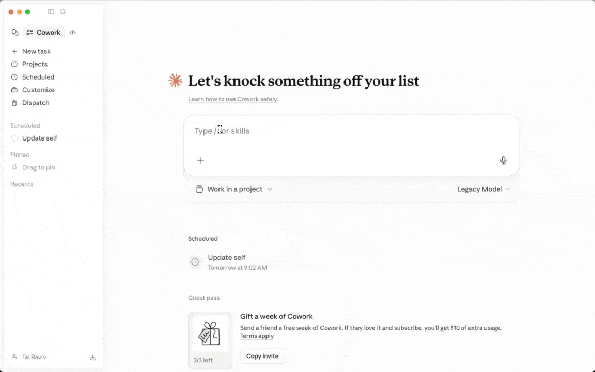

<p align="center">
   
</p>

<h1 align="center">Let AI watch you work</h1>

<h4 align="center">Familiar watches your screen so your AI can update its memory, skills, and knowledge.</h4>

<p align="center">
   <a href="https://looksfamiliar.org">https://looksfamiliar.org</a>
</p>

<p align="center">
  <a href="https://github.com/familiar-software/familiar/blob/main/LICENSE"></a>
</p>

---

We created Familiar to capture our screen (and clipboard) every 4 seconds and save it as markdown. That way our local agent can use that as context (through a cron, skill, or slash command).

## Use Familiar with your favorite agent

### Self-updating


### As a skill



## What people use Familiar for

- Fill the gap between AI tools: meeting transcribers, auto-memory layers, second brain
- Update Claude's skills/memory based on their workday (in a scheduled task/heartbeat)
- Typing "help me with what I'm working on right now" without having to prompt/describe what's going on their screen
- Enriching meeting transcripts with what was actually on screen (and vice versa)
- Forking it into their coaching app so coaches can see what learners did between sessions
- Someone new to tech used Familiar during a trial week at a YC startup, so that AI could coach him every few hours (and got the job)

## How agents use the output

Early users often report AI using Familiar's context as "connective tissue" or a "routing layer" to help agents map between resources. Recently, my agent "saw" that I spent a long time on a document, so it fetched the full doc directly. We've also seen the agent traverse the markdown, then decide to fetch the original image (so cool).

## The Bitter Lesson comes to our screens

We stand on the shoulders of giants: screenpipe, rewind, dayflow, etc. Since then: 1) Local agents got good at handling massive amounts of messy text files 2) Local agents have their own memory and skills systems.

Familiar is our "bitter lesson" version: just hand over context and get out of the way. The right way to do that piece is open source / free / offline.

## Privacy

Familiar uses Apple's native OCR, deletes screenshot images after 48 hours, and redacts passwords/credit card numbers/SSNs/API tokens/etc. We'd love contributions on what else to block: https://github.com/familiar-software/familiar/tree/main/src/ or in general ways to improve privacy.


## Additional Details

- Settings: `~/.familiar/settings.json`
- Captured still images: `<contextFolderPath>/familiar/stills/`
- Extracted markdown for captured still images: `<contextFolderPath>/familiar/stills-markdown/`
- Clipboard text mirrors while recording: `<contextFolderPath>/familiar/stills-markdown/<sessionId>/<timestamp>.clipboard.txt`
- Before still markdown and clipboard text are written, Familiar runs `rg`-based redaction for password/API-key patterns. If the scanner fails twice, Familiar still saves the file and shows a one-time warning toast per recording session.

## Build locally

```bash
git clone https://github.com/familiar-software/familiar.git
cd familiar
npm install
npm run dist:mac
```

`npm run dist:mac*` includes `npm run build:rg-bundle`, which prepares `scripts/bin/rg/*` and packages it into Electron resources at `resources/rg/`.

`build-rg-bundle.sh` downloads official ripgrep binaries when missing (or copies from `FAMILIAR_RG_DARWIN_ARM64_SOURCE` / `FAMILIAR_RG_DARWIN_X64_SOURCE` if provided). The binaries are generated locally and are not committed.
