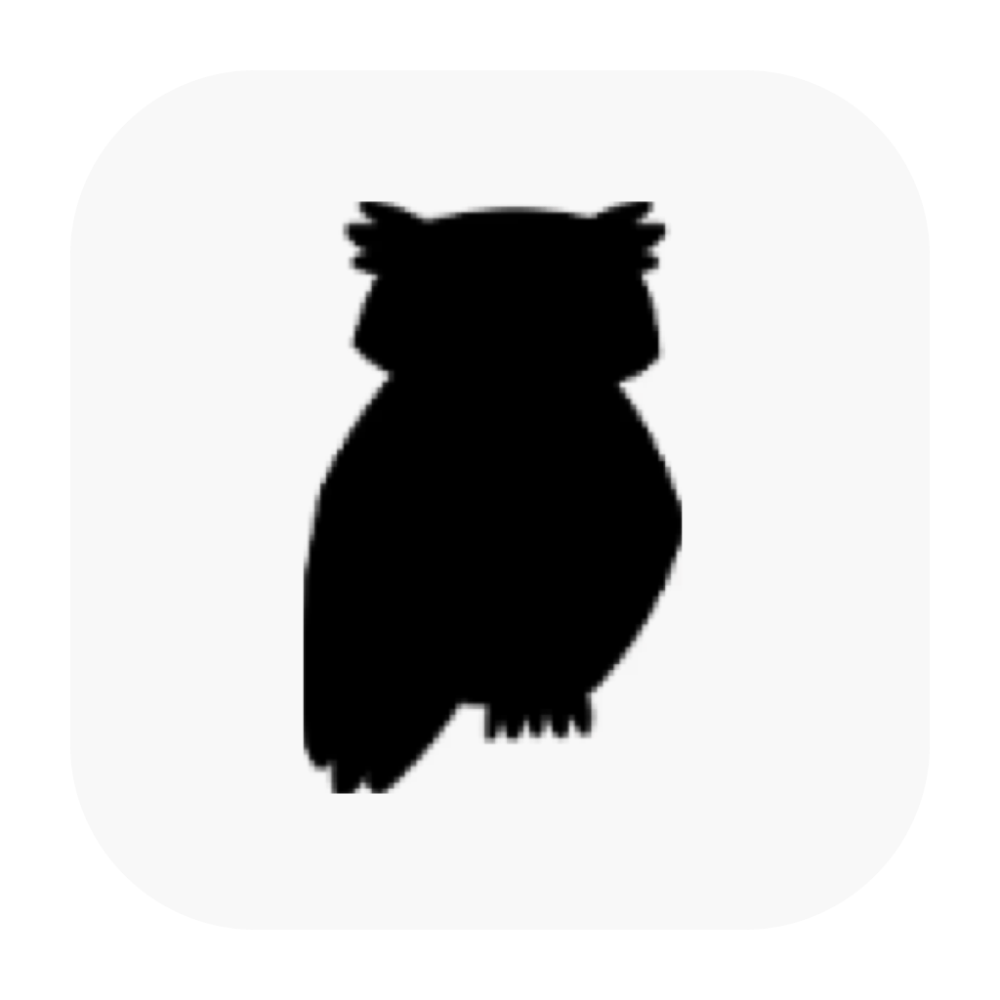

<p align="center">
   
</p>

<h1 align="center">Let AI watch you work.</h1>

<h4 align="center">Familiar watches your screen so your AI can update its memory, skills, and knowledge.</h4>

<a align="center" href="https://looksfamiliar.org">https://looksfamiliar.org</a.

<p align="center">
  <a href="https://github.com/familiar-software/familiar/blob/main/LICENSE"></a>
</p>

Familiar is a Mac app that, every few seconds, captures your screen and OCRs into markdown (also captures clipboard). Your local agent can use it however it wants: in a cron to update its own memory and skills, or use it as a skill. 

(under the hood we use Apple's Vision OCR, delete screenshots after 2 days, and redact passwords, credit card numbers, SSNs, API tokens, and private keys.)

We stand on the shoulders of giants: screenpipe, rewind, dayflow, etc. two things changed since then:
1) Local agents got good at handling massive amounts of messy text files 
2) Local agents come with memory and skill systems

What's left is to turn the world into context and get out of the way. 

Our one reason to exist is that this needs to be open/free/offline to work. 

We expect Familiar will primarily be a resource for AI to self-update its own memory, knowledge base, skills, etc. (esp with loops, heartbeats, and KAIROS). We got inspired by a friend who wrote a daily script that scans Familiar's markdown for markers and auto-updates his skill files. You can also type /familiar when you have a question that needs screen context, like "help me with what I'm working on right now."

## Additional Details

- Settings: `~/.familiar/settings.json`
- Captured still images: `<contextFolderPath>/familiar/stills/`
- Extracted markdown for captured still images: `<contextFolderPath>/familiar/stills-markdown/`
- Clipboard text mirrors while recording: `<contextFolderPath>/familiar/stills-markdown/<sessionId>/<timestamp>.clipboard.txt`
- Before still markdown and clipboard text are written, Familiar runs `rg`-based redaction for password/API-key patterns. If the scanner fails twice, Familiar still saves the file and shows a one-time warning toast per recording session.

## Build locally

```bash
git clone https://github.com/familiar-software/familiar.git
cd familiar
npm install
npm run dist:mac
```

`npm run dist:mac*` includes `npm run build:rg-bundle`, which prepares `scripts/bin/rg/*` and packages it into Electron resources at `resources/rg/`.

`build-rg-bundle.sh` downloads official ripgrep binaries when missing (or copies from `FAMILIAR_RG_DARWIN_ARM64_SOURCE` / `FAMILIAR_RG_DARWIN_X64_SOURCE` if provided). The binaries are generated locally and are not committed.
